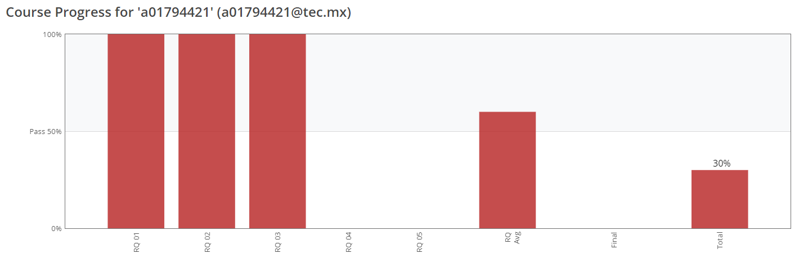

# Actividades_Aprendizaje

##### Jorge Steven Reyes - A01794421
##### a01794421@tec.mex

#### 1. [Python for Data Science Course](1_Python_for_Data_Science_course/) - Progress
##### Course finished 04/10/2022 - [Certificate](assets/Capture15.PNG)

#### 2. [Semana 3 - Actividad 1](week3_activity1/Activity_1-Week_3.ipynb)

#### 3. [Data Analysis with Python](2_Data_Analysis_with_Python_course/) - Progress
##### Module 2 finished 18/10/2022

